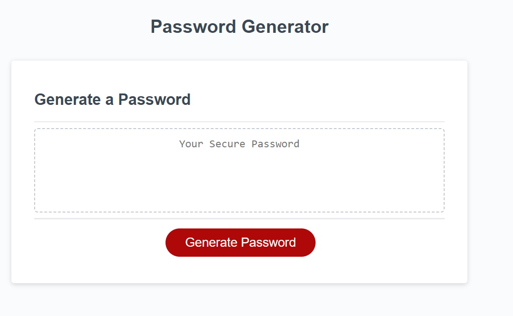
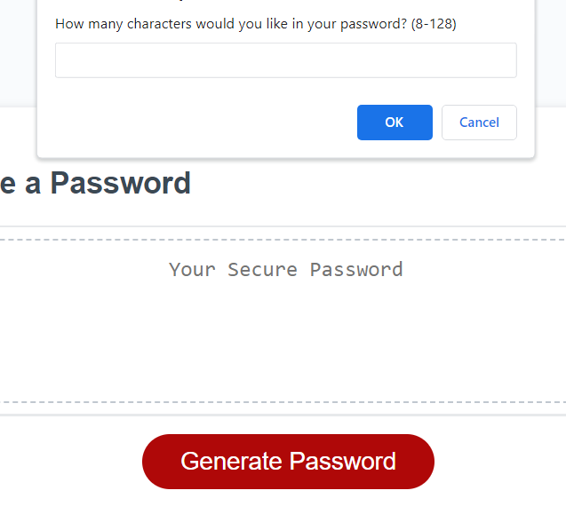
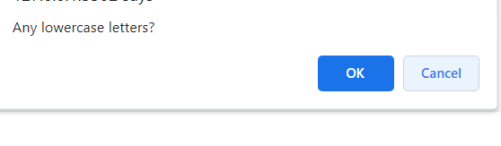
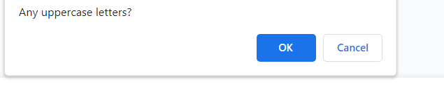
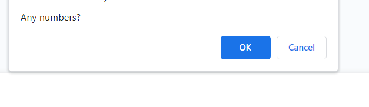
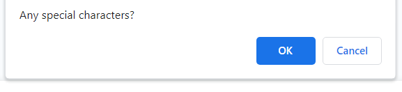
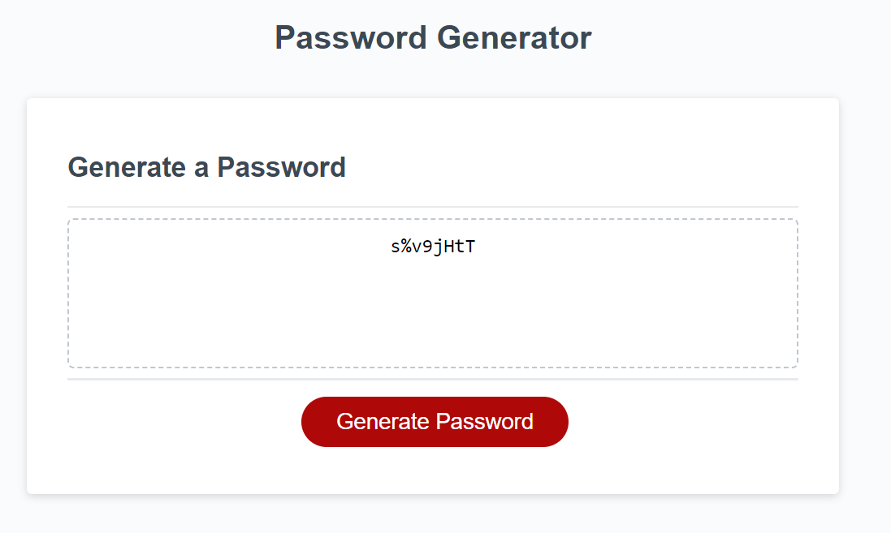

# Challenge-Three-UTA
03 JavaScript: Password Generator

**Goal**
To modify the starter code to create an application that enables employees to generate random passwords based on criteria that they’ve selected. 

**Scope of Work**
The welcome page requires the user to click on *generate password* button. When clicked, the user is prompted with 5 prompts which satisfies the criteria to generate random password.

**The password should contain the following:**
The characters must be between 8 and 128.
*Optional to choose any of the following OR all.*
Lower case letter
Upper case letter
Numbers 
Special Characters

**Welcome Page**

**Once the generate password button is clicked it will ask series of prompt questions where the user can choose 'ok' or 'cancel'.**

** The password is generated **

**Credits**
Edited by Kai Gurung-Doll; https://github.com/KaiDoll.
Link to the Challenge: https://kaidoll.github.io/Challenge-Three-UTA/

